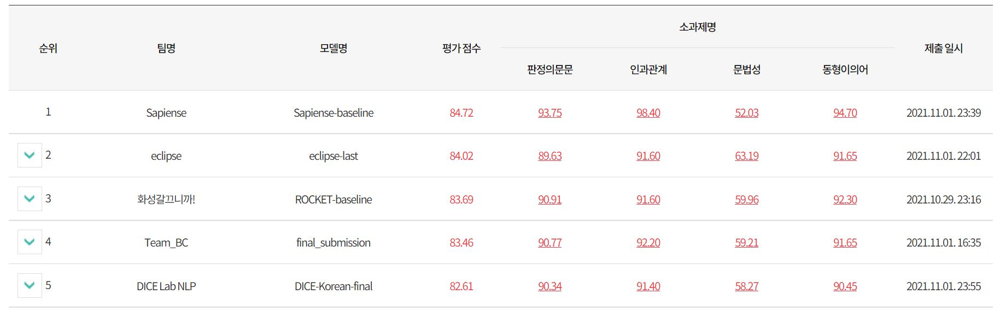

# NIKL-KLUE

This repository is the **"Team-BC"** team code for the 2021 National Institute of Korean Language Artificial Intelligence Language Competition. 

Teammate : [김강민](https://github.com/Gangsss), [김현우](https://github.com/choco9966), [이동빈](https://github.com/Dongbin-Lee-git), [신문종](https://github.com/moon-jong), [서석민](https://github.com/min1321), [임도훈](https://github.com/vail131)

## Pretrained model & data  
need extract inside each task folder  

- boolq : https://drive.google.com/file/d/1k-6W3bTqFVlSBBtsJ42kPcBdBCO7bQkD/view?usp=sharing  
- copa : https://drive.google.com/file/d/1PxwwOiYxKb7PUBVByX0LYwnXm9IY6lfh/view?usp=sharing  
- cola : https://drive.google.com/file/d/1SqFO4E2M1qIIJHusubUb5r2dklLdvlME/view?usp=sharing  
- wic : https://drive.google.com/drive/folders/1Jj-AgW7w608gwwrBFUujiv104huK3zLl?usp=sharing

## Docker inference  
If you have a gpu, run it on a gpu-inference branch  
1. make docker image  

  `docker build -t inference-docker -f Dockerfile .`
2. run docker container  
  `docker run -v "$PWD:/mnt/work" -it inference-docker`
3. do inference  
  `sh all_inference.sh`

## Presentation PDF
- https://github.com/NIKL-Team-BC/NIKL-KLUE/blob/main/2021_NIKL_Team_BC.pdf